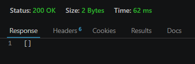
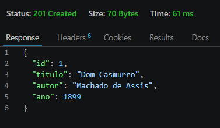
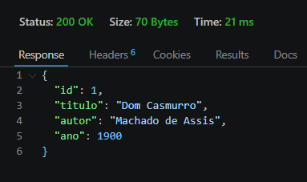
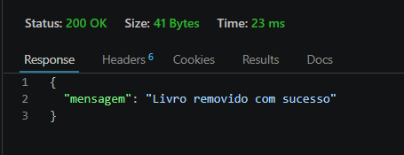

# API Biblioteca

API REST para gerenciamento de livros com Node.js, Express e PostgreSQL.

## Como executar

1. Clone o repositório:
```bash
git clone https://github.com/Italorlq/api-biblioteca.git
cd api-biblioteca
```

2. Suba os containers:
```bash
docker compose up -d
```

3. Acesse: http://localhost:3000

## Rotas

| Método | Rota | Descrição |
|--------|------|-----------|
| GET | / | Status da API |
| GET | /livros | Lista todos os livros |
| GET | /livros/:id | Busca livro por ID |
| POST | /livros | Cadastra novo livro |
| PUT | /livros/:id | Atualiza um livro |
| DELETE | /livros/:id | Remove um livro |

## Testes

### GET


### POST


### PUT


### DELETE


## Parar a aplicação

```bash
docker compose down
```
